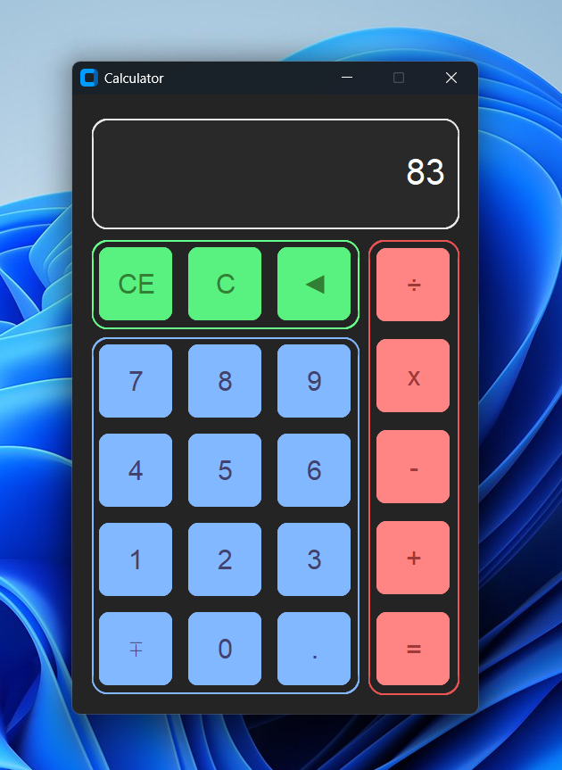

# Python Calculator


A modern desktop calculator built with **Python** and **CustomTkinter**.

This project was created as a learning exercise to improve my Python programming, GUI development, and application logic skills.

---

## ✨ Features

- 🎨 Modern CustomTkinter interface
- ⌨️ Keyboard shortcuts
- ➕ Basic arithmetic operations
- ➖ Positive / Negative toggle (Esc)
- 🔢 Decimal precision using `Decimal`
- ⌫ Backspace support
- 🧹 Clear (C) and Clear Everything (CE)
- 🚫 Division-by-zero error handling
- 🔗 Chained calculations
- 🎬 Button click animations
- 📏 Display overflow protection

---

## 📸 Screenshot



---

## 🛠️ Built With

- Python 3.12
- CustomTkinter
- Decimal
- Collections (deque)

---

## 🚀 Installation

Clone the repository

```bash
git clone https://github.com/ShayanSafari-dev/Python-Calculator.git
```

Go into the project

```bash
cd Python-Calculator
```

Install the required package

```bash
pip install -r requirements.txt
```

Run the application

```bash
python calculator.py
```

---

## 📂 Project Structure

```
Python-Calculator/
│
├── calculator.py
├── requirements.txt
├── README.md
├── LICENSE
├── .gitignore
└── screenshots/
      └── calculator.png
```

---

## 🎯 Future Improvements

- Scientific calculator mode
- Calculation history
- Themes (Light/Dark)
- Memory buttons (M+, MR, MC)
- Percentage support
- Better code refactoring using classes

---

## 📚 What I Learned

While building this project, I practiced:

- Python GUI development
- Event-driven programming
- Keyboard event handling
- State management
- Error handling
- Working with decimal numbers
- Organizing larger Python projects

---

## 📄 License

This project is licensed under the MIT License.

---

⭐ If you like this project, consider giving it a star! :)
